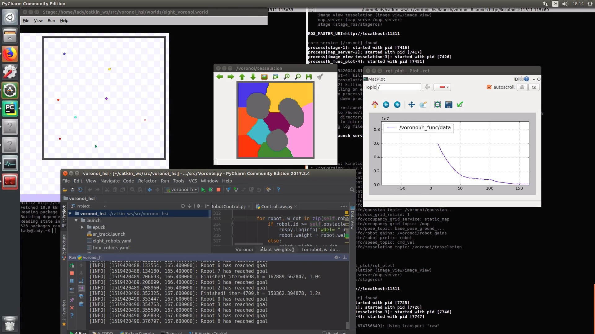

# Voronoi HSI (Human-Swarm Interaction)

Multi **robot coverage control** in non-convex environments using **ROS**.



This is a ROS implementation of a multi-robot coverage control strategy based in [[1]](http://journals.sagepub.com/doi/full/10.1177/0278364913507324) and [[2]](http://sites.bu.edu/msl/files/2014/10/PiersonFigueiredoPimentaSchwagerICRA15.pdf) to address coverage in non-convex environments and adapt to performance variations.

It also has an add-on software for Unity that allows humans to interact with the robotic swarm, influencing their coverage task: [Voronoi Unity Teleoperation](https://github.com/lucascoelhof/VoronoiUnityTeleoperation)

## Getting started

Dependencies:

* [Stage](http://wiki.ros.org/stage)
* [matplotlib](https://matplotlib.org/)
* [ar_track_alvar](http://wiki.ros.org/ar_track_alvar)
* [gctronic/epuck_driver](https://github.com/gctronic/epuck_driver)

Download the code, place it on your catkin environment, compile it using ``catkin_make`` and run using:

```
roslaunch voronoi_hsi voronoi_8_with_app.launch
```

If you want to use real robots (epucks) instead of simulating it on Stage, you will need the driver [gctronic/epuck_driver](https://github.com/gctronic/epuck_driver). Run it using:

```
roslaunch voronoi_hsi voronoi_8_with_app.launch real_robot:=true
```

## Human-Swarm Interaction Integration

This application can run standalone, but it can also run integrated with a VR application, which allows users to interact with the
robotic swarm in the coverage task.

Please follow instructions at [Voronoi Unity Teleoperation](https://github.com/lucascoelhof/VoronoiUnityTeleoperation) to setup and
run the VR application.

## License

This project is distibuted under the [BSD 3-Clause License](LICENSE).

## References

1. [Bhattacharya, S., Ghrist, R. and Kumar, V., 2014. Multi-robot coverage and exploration on Riemannian manifolds with boundaries. The International Journal of Robotics Research, 33(1), pp.113-137.](http://journals.sagepub.com/doi/full/10.1177/0278364913507324)
2. [Pierson, A., Figueiredo, L.C., Pimenta, L.C. and Schwager, M., 2015, May. Adapting to performance variations in multi-robot coverage. In Robotics and Automation (ICRA), 2015 IEEE International Conference on (pp. 415-420). IEEE.](http://sites.bu.edu/msl/files/2014/10/PiersonFigueiredoPimentaSchwagerICRA15.pdf)
